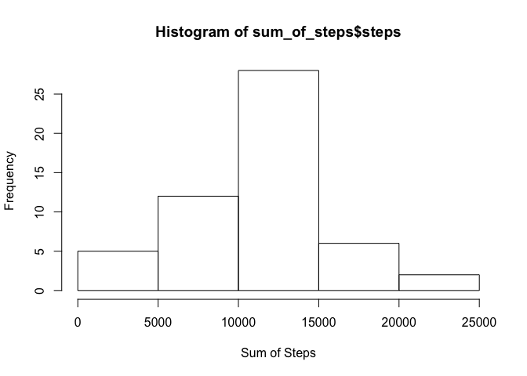
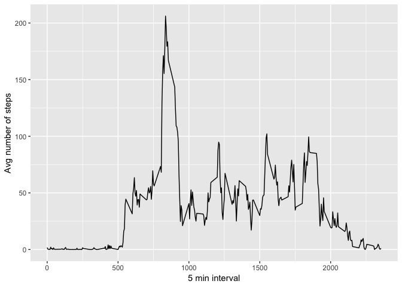
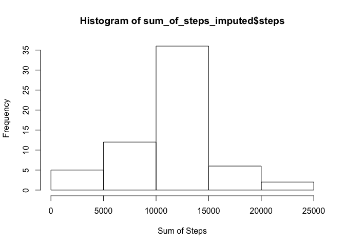
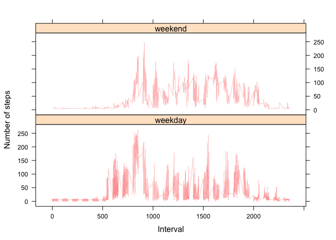

Getting Data - reading the given csv file into R


```r
data_full <- read.csv("activity.csv", header=TRUE)
```

Cleaning Data and looking at histogram -grouping data by steps and date and looking at the histogram


```r
data_full$date <- as.POSIXct(data_full$date, format="%Y-%m-%d")

data_full <- data.frame(date=data_full$date, 
                        weekday=tolower(weekdays(data_full$date)), 
                        steps=data_full$steps, 
                        interval=data_full$interval)
data_full_final <- cbind(data_full,daytype=ifelse(data_full$weekday == "saturday" | data_full$weekday == "sunday", "weekend", "weekday"))

sum_of_steps <- aggregate(steps~date,data_full_final, FUN = sum, na.rm=TRUE)
hist(sum_of_steps$steps, xlab = "Sum of Steps", ylab= "Frequency")
```

<!-- -->

Looking at the mean and median of steps taken each day


```r
mean_steps <- mean(sum_of_steps$steps)
median_steps <- median(sum_of_steps$steps,na.rm=TRUE)
mean_steps
```

```
## [1] 10766.19
```

```r
median_steps
```

```
## [1] 10765
```


Time series plot of the average number of steps taken - aggregate or group data by steps and interval and look at the mean. Followed bvy plotting of the time serie data.


```r
library(ggplot2)
avg_steps <- aggregate(steps~interval, data_full_final, mean)
ggplot(data=avg_steps,aes(interval,steps))+geom_line()+
  xlab("5 min interval")+
  ylab("Avg number of steps")
```

<!-- -->

The 5-minute interval that, on average, contains the maximum number of steps


```r
max_5min <- avg_steps[which.max(avg_steps$steps),]
max_5min
```

```
##     interval    steps
## 104      835 206.1698
```

Code to describe and show a strategy for imputing missing data

I looked at the total number of missing values in the dataset:


```r
missing <- is.na(data_full_final)
sum(missing)
```

```
## [1] 2304
```

```r
sum(missing)/nrow(data_full_final)
```

```
## [1] 0.1311475
```

That's about 13% of the data. So instead of ignoring the missing values, I am going to take the mean of the avg_steps and replace all NA values with this average.Before doing this, I am copying the data to another variable called data_imputed.


```r
data_imputed <- data_full_final

for (i in 1:nrow(data_imputed)){
  if (is.na(data_imputed[i,3])==TRUE){
    data_imputed[i,3]=mean(avg_steps$steps)}}
```

Let's look at NA count in data_imputed.


```r
sum(is.na(data_imputed))
```

```
## [1] 0
```

Let's now look at the summary of data_full and data_imputed.


```r
summary(data_full_final)
```

```
##       date                          weekday         steps       
##  Min.   :2012-10-01 00:00:00   friday   :2592   Min.   :  0.00  
##  1st Qu.:2012-10-16 00:00:00   monday   :2592   1st Qu.:  0.00  
##  Median :2012-10-31 00:00:00   saturday :2304   Median :  0.00  
##  Mean   :2012-10-31 00:25:34   sunday   :2304   Mean   : 37.38  
##  3rd Qu.:2012-11-15 00:00:00   thursday :2592   3rd Qu.: 12.00  
##  Max.   :2012-11-30 00:00:00   tuesday  :2592   Max.   :806.00  
##                                wednesday:2592   NA's   :2304    
##     interval         daytype     
##  Min.   :   0.0   weekday:12960  
##  1st Qu.: 588.8   weekend: 4608  
##  Median :1177.5                  
##  Mean   :1177.5                  
##  3rd Qu.:1766.2                  
##  Max.   :2355.0                  
## 
```

```r
summary(data_imputed)
```

```
##       date                          weekday         steps       
##  Min.   :2012-10-01 00:00:00   friday   :2592   Min.   :  0.00  
##  1st Qu.:2012-10-16 00:00:00   monday   :2592   1st Qu.:  0.00  
##  Median :2012-10-31 00:00:00   saturday :2304   Median :  0.00  
##  Mean   :2012-10-31 00:25:34   sunday   :2304   Mean   : 37.38  
##  3rd Qu.:2012-11-15 00:00:00   thursday :2592   3rd Qu.: 37.38  
##  Max.   :2012-11-30 00:00:00   tuesday  :2592   Max.   :806.00  
##                                wednesday:2592                   
##     interval         daytype     
##  Min.   :   0.0   weekday:12960  
##  1st Qu.: 588.8   weekend: 4608  
##  Median :1177.5                  
##  Mean   :1177.5                  
##  3rd Qu.:1766.2                  
##  Max.   :2355.0                  
## 
```

We can see that there is no major change in the summary of the two data frames. 

Now let's plot the histogram of the steps and its mean and median values. 


```r
sum_of_steps_imputed <- aggregate(steps~date,data_imputed, FUN = sum)
hist(sum_of_steps_imputed$steps, xlab = "Sum of Steps", yalb = "Frequency")
```

```
## Warning in plot.window(xlim, ylim, "", ...): "yalb" is not a graphical
## parameter
```

```
## Warning in title(main = main, sub = sub, xlab = xlab, ylab = ylab, ...):
## "yalb" is not a graphical parameter
```

```
## Warning in axis(1, ...): "yalb" is not a graphical parameter
```

```
## Warning in axis(2, ...): "yalb" is not a graphical parameter
```

<!-- -->

```r
mean_steps_im <- mean(sum_of_steps_imputed$steps)

median_steps_im <- median(sum_of_steps_imputed$steps,na.rm=TRUE)
mean_steps_im
```

```
## [1] 10766.19
```

```r
median_steps_im
```

```
## [1] 10766.19
```

If we compare these to our previous histogram and mean/median values - there is no major impact due to imputing the NA values. 

Are there differences in activity patterns between weekdays and weekends?


```r
head(data_imputed) #after replacing NA values with mean
```

```
##         date weekday   steps interval daytype
## 1 2012-10-01  monday 37.3826        0 weekday
## 2 2012-10-01  monday 37.3826        5 weekday
## 3 2012-10-01  monday 37.3826       10 weekday
## 4 2012-10-01  monday 37.3826       15 weekday
## 5 2012-10-01  monday 37.3826       20 weekday
## 6 2012-10-01  monday 37.3826       25 weekday
```

Panel plot with time series plot:


```r
library(lattice)
mean_data <- aggregate(data_imputed$steps, 
                       by=list(data_imputed$daytype, 
                               data_imputed$weekday, data_imputed$interval), mean)
names(mean_data) <- c("daytype", "weekday", "interval", "mean")
head(mean_data)
```

```
##   daytype  weekday interval     mean
## 1 weekday   friday        0 8.307244
## 2 weekday   monday        0 9.418355
## 3 weekend saturday        0 4.672825
## 4 weekend   sunday        0 4.672825
## 5 weekday thursday        0 9.375844
## 6 weekday  tuesday        0 0.000000
```

```r
xyplot(mean ~ interval | daytype, mean_data, 
       type="l", 
       lwd=0.25, col="red",
       xlab="Interval", 
       ylab="Number of steps", 
       layout=c(1,2))
```

<!-- -->

